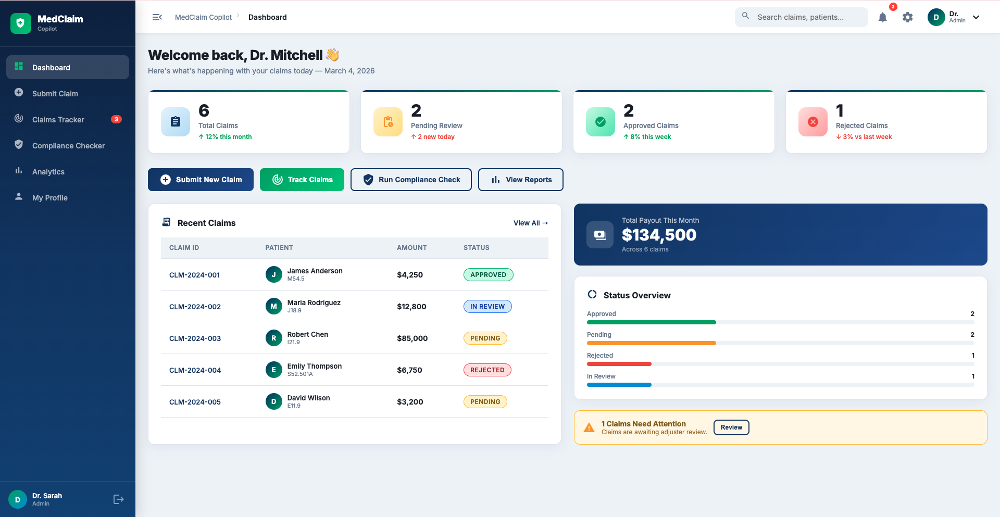
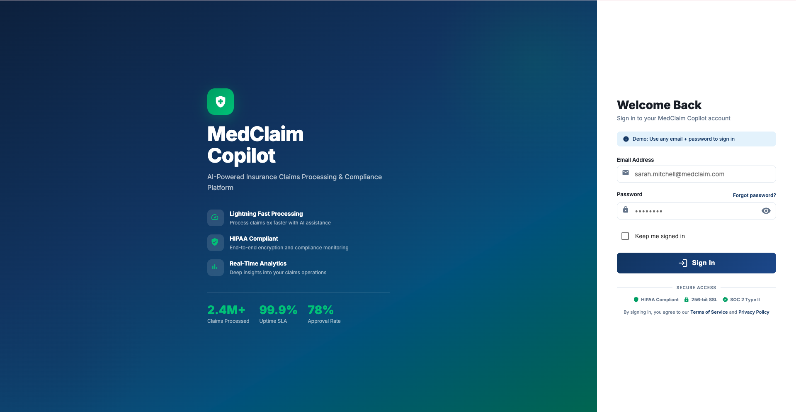
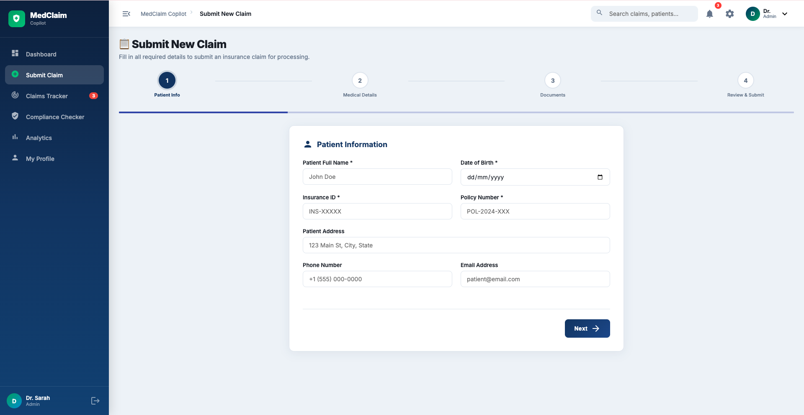
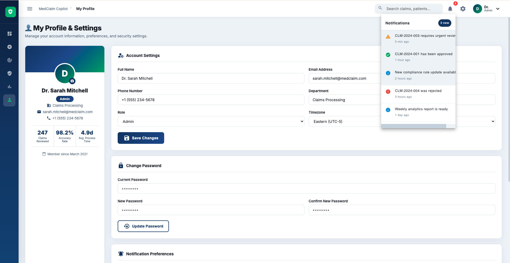
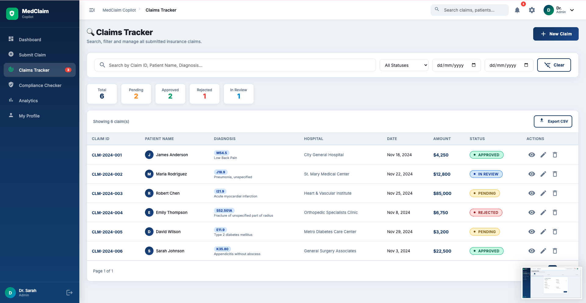
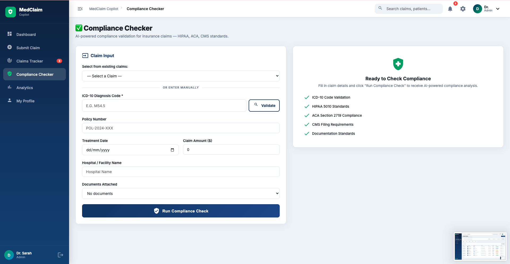
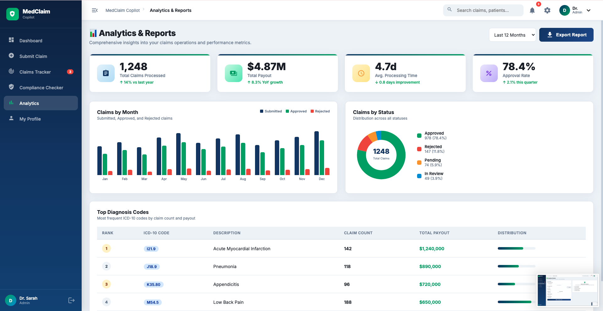
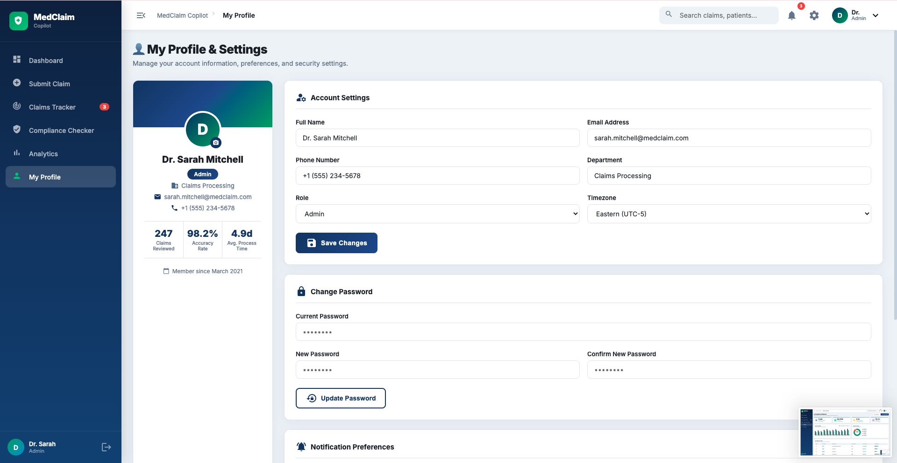
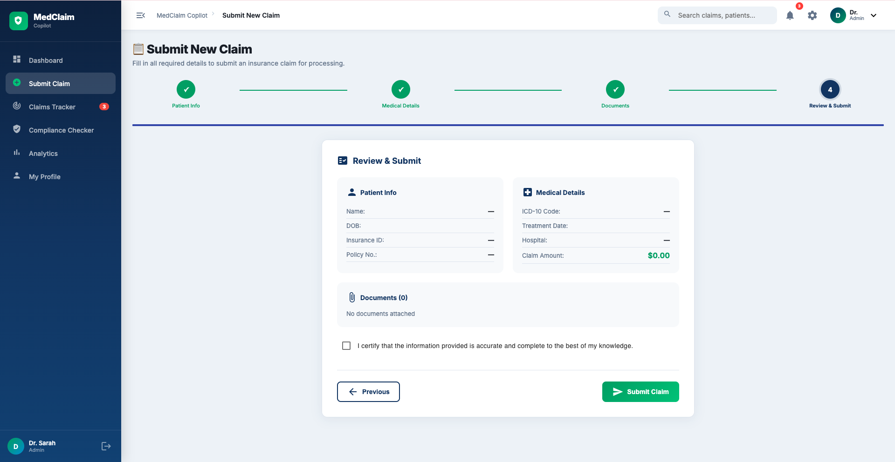

# 🏥 MedClaim Copilot — Insurance Claim Assistant

<div align="center">



<br/><br/>

[](https://angular.io/)
[](https://dotnet.microsoft.com/)
[](https://www.typescriptlang.org/)
[](https://docs.microsoft.com/en-us/dotnet/csharp/)
[]()
[](LICENSE)
[]()

<br/>

> **AI-Powered Insurance Claims Processing & Compliance Platform**  
> Built for InsurTech & Healthcare Compliance teams — streamline claims, ensure HIPAA compliance, and gain deep analytics insights.

[🚀 Live Demo](#) · [📖 Documentation](#) · [🐛 Report Bug](#) · [💡 Request Feature](#)

</div>

---

## 📋 Table of Contents

- [About](#-about)
- [Key Features](#-key-features)
- [Screenshots](#-screenshots)
- [Tech Stack](#-tech-stack)
- [Project Structure](#-project-structure)
- [Getting Started](#-getting-started)
- [API Endpoints](#-api-endpoints)
- [Configuration](#-configuration)
- [License](#-license)

---

## 🎯 About

**MedClaim Copilot** is a comprehensive, enterprise-grade web application designed for insurance companies, healthcare providers, and compliance teams to manage the entire insurance claim lifecycle — from submission to approval — with AI-powered compliance validation.

### 🌟 Why MedClaim Copilot?

- ⚡ **5x Faster Processing** — Automate routine compliance checks and claim routing
- 🔒 **HIPAA Compliant** — End-to-end security with audit trails and access controls
- 🧠 **AI Compliance Engine** — Real-time ICD-10 validation and regulatory analysis
- 📊 **Deep Analytics** — Live dashboards with claims performance metrics
- 🎨 **Beautiful UI** — Modern, intuitive interface built with Angular Material

---

## ✨ Key Features

| Feature | Description |
|---------|-------------|
| 🏠 **Dashboard** | Real-time overview of all claims with KPIs and status distribution |
| 📋 **Claim Submission** | Multi-step guided wizard with document upload |
| 🔍 **Claims Tracker** | Advanced search, filtering, and pagination |
| 📄 **Claim Detail** | Full claim view with timeline, documents, and adjuster actions |
| ✅ **Compliance Checker** | AI-powered HIPAA, ACA & CMS validation with scoring |
| 📊 **Analytics** | Charts, trends, and performance reports |
| 👤 **User Profile** | Account management and notification preferences |
| 🔐 **Secure Login** | JWT authentication with role-based access |

---

## 📸 Screenshots

> Below are 10 key screens from the MedClaim Copilot application.

---

### 🔐 Screen 1 — Login Page

> Secure authentication with branded login UI, healthcare compliance trust badges, and feature highlights.



**Features:** Email/password login · JWT token auth · Branded left panel · Trust badges · Demo mode

---

### 🏠 Screen 2 — Dashboard

> Central hub with KPI stat cards, recent claims table, status distribution bars, and quick action buttons.


**Features:** 4 KPI cards · Recent claims table · Status progress bars · Payout banner · Alert notifications

---

### 📋 Screen 3 — Submit New Claim

> 4-step guided form wizard with patient info, medical details, document upload, and final review.



**Features:** 4-step wizard · Progress bar indicator · Drag & drop upload · ICD-10 code input · Review summary

---

### 📋 Screen 4 — Claim Review & Submission

> Final step of the claim wizard where users can review all entered data and documents before final submission.



---

### 🔍 Screen 5 — Claims Tracker

> Searchable, filterable claims table with status badges, pagination, and bulk actions.



**Features:** Full-text search · Status/date filters · Color-coded badges · Per-row actions · Pagination · CSV export

---

### 📄 Screen 6 — Claim Detail View

> Complete claim breakdown with patient info, medical details, claim timeline, documents list, and adjuster controls.


**Features:** Patient & medical cards · Event timeline · Document viewer · Adjuster notes editor · Approve/Reject/Review actions

---

### ✅ Screen 7 — Compliance Checker

> AI-powered compliance analysis with ICD-10 validation, compliance score, issue detection, and recommendations.



**Features:** ICD-10 live validation · Compliance % score · Severity-coded issues · Regulatory citations · AI recommendations

---

### 📊 Screen 8 — Analytics & Reports

> Charts including monthly bar chart, status donut chart, KPI cards, and top diagnosis codes table.



**Features:** 4 KPI cards · 12-month bar chart · Status donut chart · Top 5 diagnosis codes · Export button · Date range filter

---

### 👤 Screen 9 — User Profile & Settings

> Account management with profile card, settings form, password change, and notification preferences toggles.



**Features:** Profile card with stats · Account settings form · Password strength meter · Notification toggles · Role management

---

### 🔔 Screen 10 — Notifications & Alerts

> Real-time notification center allowing users to track claim updates, approval status, and compliance alerts.



---

## 🛠 Tech Stack

### Frontend
| Technology | Version | Purpose |
|------------|---------|---------|
| **Angular** | 17+ | SPA Framework |
| **Angular Material** | 17+ | UI Component Library |
| **TypeScript** | 5.4 | Type-Safe JavaScript |
| **RxJS** | 7.8 | Reactive Programming |
| **CSS3** | — | Custom Styling & Animations |

### Backend
| Technology | Version | Purpose |
|------------|---------|---------|
| **ASP.NET Core** | 8.0 | Web API Framework |
| **C#** | 12 | Backend Language |
| **Swagger/OpenAPI** | 6.5 | API Documentation |
| **Entity Framework Core** | 8.0 | ORM (production) |
| **JWT Bearer** | 8.0 | Authentication |

---

## 📁 Project Structure

```
MedClaimCopilot/
│
├── 📁 assets/                     # Project assets (branding & screenshots)
│   └── 📁 screenshots/            # Application screen captures
├── 📁 medclaim-frontend/          # Angular Frontend
│   ├── 📁 src/
│   │   ├── 📁 app/
│   │   │   ├── 📁 components/
│   │   │   │   ├── 🖥️ dashboard/          # Dashboard screen
│   │   │   │   ├── 📋 submit-claim/        # New claim wizard
│   │   │   │   ├── 🔍 claims-tracker/      # Claims list & search
│   │   │   │   ├── 📄 claim-detail/        # Claim detail view
│   │   │   │   ├── ✅ compliance-checker/  # AI compliance check
│   │   │   │   ├── 📊 analytics/           # Reports & charts
│   │   │   │   ├── 👤 profile/             # User settings
│   │   │   │   ├── 🔐 login/               # Authentication
│   │   │   │   ├── 🗂️ sidebar/             # Navigation sidebar
│   │   │   │   └── 🔝 navbar/              # Top navigation bar
│   │   │   ├── 📁 services/
│   │   │   │   ├── auth.service.ts
│   │   │   │   ├── claims.service.ts
│   │   │   │   ├── compliance.service.ts
│   │   │   │   └── analytics.service.ts
│   │   │   ├── 📁 models/
│   │   │   │   └── claim.model.ts
│   │   │   ├── 📁 guards/
│   │   │   │   └── auth.guard.ts
│   │   │   ├── app.module.ts
│   │   │   ├── app-routing.module.ts
│   │   │   └── app.component.ts
│   │   ├── styles.css             # Global styles & design tokens
│   │   └── index.html
│   ├── angular.json
│   └── package.json
│
├── 📁 medclaim-api/               # ASP.NET Core Backend
│   ├── 📁 Controllers/
│   │   ├── ClaimsController.cs    # CRUD for claims
│   │   ├── ComplianceController.cs # Compliance checks
│   │   └── AuthController.cs      # Authentication
│   ├── 📁 Models/
│   │   ├── Claim.cs
│   │   ├── User.cs
│   │   └── ComplianceResult.cs
│   ├── Program.cs
│   ├── appsettings.json
│   └── MedClaimCopilot.API.csproj
│
└── 📄 README.md
```

---

## 🚀 Getting Started

### Prerequisites

- **Node.js** 18+ and **npm** 9+
- **Angular CLI** 17+: `npm install -g @angular/cli`
- **.NET SDK** 8.0+
- **Visual Studio 2022** or **VS Code**

---

### 🔷 Frontend — Angular Setup

```bash
# 1. Navigate to frontend directory
cd medclaim-frontend

# 2. Install dependencies
npm install

# 3. Start development server
ng serve

# 4. Open browser
# http://localhost:4200
```

> **Demo Login:** Use any email + password combination to sign in.

---

### 🔶 Backend — ASP.NET Core Setup

```bash
# 1. Navigate to API directory
cd medclaim-api

# 2. Restore NuGet packages
dotnet restore

# 3. Run the API
dotnet run

# 4. Open Swagger UI
# https://localhost:7001/swagger
```

---

### 🐳 Docker Setup (Optional)

```bash
# Build and run with Docker Compose
docker-compose up --build

# Frontend: http://localhost:4200
# Backend:  http://localhost:7001
# Swagger:  http://localhost:7001/swagger
```

---

## 📡 API Endpoints

### 🔐 Auth
| Method | Endpoint | Description |
|--------|----------|-------------|
| `POST` | `/api/auth/login` | User login — returns JWT token |
| `GET` | `/api/auth/me` | Get current user profile |

### 📋 Claims
| Method | Endpoint | Description |
|--------|----------|-------------|
| `GET` | `/api/claims` | Get all claims (with filters & pagination) |
| `GET` | `/api/claims/{id}` | Get claim by ID |
| `POST` | `/api/claims` | Submit new claim |
| `PATCH` | `/api/claims/{id}/status` | Update claim status |
| `DELETE` | `/api/claims/{id}` | Delete a claim |
| `GET` | `/api/claims/stats` | Get claim statistics |

### ✅ Compliance
| Method | Endpoint | Description |
|--------|----------|-------------|
| `POST` | `/api/compliance/check` | Run compliance analysis |
| `GET` | `/api/compliance/validate-icd/{code}` | Validate ICD-10 code |

---

## ⚙️ Configuration

### Frontend Environment (`src/environments/environment.ts`)
```typescript
export const environment = {
  production: false,
  apiUrl: 'https://localhost:7001/api',
  appName: 'MedClaim Copilot',
  version: '1.0.0'
};
```

### Backend (`appsettings.json`)
```json
{
  "Jwt": {
    "Key": "your-secure-secret-key",
    "Issuer": "MedClaimCopilot",
    "ExpiryInHours": 24
  },
  "AppSettings": {
    "MaxClaimAmount": 1000000,
    "HighValueThreshold": 50000
  }
}
```

---

## 🎨 Design System

| Token | Value | Usage |
|-------|-------|-------|
| `--primary` | `#1a3c6e` | Primary brand color (deep blue) |
| `--accent` | `#00a86b` | Accent / success (medical green) |
| `--danger` | `#e74c3c` | Rejected/error states |
| `--warning` | `#f39c12` | Pending/warning states |
| `--bg` | `#f0f4f8` | Page background |
| `--radius` | `12px` | Default border radius |
| `--font` | `Inter` | Primary typeface |

---

## 🔒 Security & Compliance

- 🛡️ **HIPAA Compliant** — PHI data handled per HIPAA guidelines
- 🔐 **JWT Authentication** — Stateless, secure token-based auth
- 🌐 **CORS** — Configured for specific origins only
- 🔒 **HTTPS** — Enforced in production
- 📋 **Audit Trails** — All claim actions logged in timeline
- 🏥 **ICD-10 Validation** — Real-time diagnosis code validation

---

## 🚧 Roadmap

- [ ] 🤖 Integrate OpenAI for enhanced compliance reasoning
- [ ] 📱 Mobile app (React Native)
- [ ] 🔗 HL7 FHIR integration
- [ ] 📬 Real-time notifications (SignalR)
- [ ] 🗄️ PostgreSQL/SQL Server database integration
- [ ] 📧 Email notification service (SendGrid)
- [ ] 📱 Two-factor authentication (2FA)
- [ ] 🌍 Multi-language support (i18n)

---

## 🤝 Contributing

1. Fork the repository
2. Create a feature branch: `git checkout -b feature/AmazingFeature`
3. Commit changes: `git commit -m 'Add AmazingFeature'`
4. Push to branch: `git push origin feature/AmazingFeature`
5. Open a Pull Request

---

## 📄 License

This project is licensed under the **MIT License** — see the [LICENSE](LICENSE) file for details.

---

## 👥 Team

Built with ❤️ by the MedClaim Copilot Team

---

<div align="center">

**MedClaim Copilot** — *Empowering Healthcare Claims with Intelligence*


</div>
